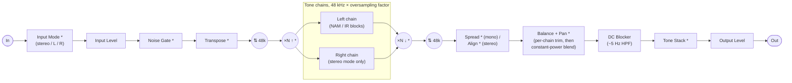
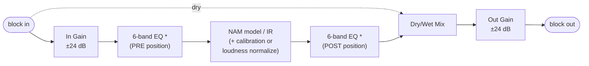

# TONE3000 Plugin

A JUCE-based audio plugin (VST3, AU, CLAP, LV2, Standalone) that loads
**Neural Amp Modeler (NAM)** captures and **impulse responses (IRs)** straight
from [TONE3000](https://www.tone3000.com). No manual file downloads: browse
the catalog, sign in, and add tones directly into your signal chain.

[Download the plugin](https://www.tone3000.com/plugin/download) for a
pre-built installer, or see the
[Plugin Guide](https://www.tone3000.com/guides/tone3000-plugin) for how to
install, load tones, and use it.

- **Load NAM and IR from TONE3000.** Click **+** to search the catalog in
  the plugin: text search, gear / format / tag / make / creator filters,
  verified creators, your recently used, favorited and created tones, all
  over the [TONE3000 API](https://www.tone3000.com/api) after a one-time
  sign-in (OAuth 2.0 + PKCE). Pick a tone and it lands in the chain with the
  right model or IR.
- **Or load local files.** Drag a `.nam` file (A2 architecture), an IR
  `.wav`, or a folder of them onto a **+** slot, or right-click a tile and
  pick **Load File / Load Folder**; no account needed. Design notes in
  [`plugin/docs/local-models.md`](plugin/docs/local-models.md).
- **Build a signal chain.** Multiple NAM and IR blocks, per-block EQ and
  gain/mix, drag to reorder, dual chains in stereo mode with branching,
  undo/redo, and presets.
- **Cross-platform.** One plugin on macOS, Windows, Linux, and iOS
  (Standalone). The UI is JUCE/C++ (`plugin/ui/`), drawn natively on every
  platform: no browser engine, no web runtime, nothing to install beside the
  plugin (see [`plugin/ui/README.md`](plugin/ui/README.md) and the design
  record in [`plugin/docs/native-ui.md`](plugin/docs/native-ui.md)).

NAM processing comes from **NeuralAmpModelerCore** (in-tree), resampling from
**AudioDSPTools** (in-tree), and tone browsing/loading from the
[TONE3000 API](https://www.tone3000.com/api).

## Prerequisites

- [CMake](https://cmake.org/download/) 3.22+ and Git
- **JUCE** is fetched automatically by CMake into `libs/`; no manual install
- A C++20 compiler: Xcode on macOS, MSVC on Windows, GCC or Clang on Linux
  (plus the dev packages listed under
  [Linux runtime dependencies](#linux-runtime-dependencies))

## Quick start

### 1. Get submodules

```sh
git submodule update --init --recursive
```

### 2. Configure CMake

CMake downloads JUCE into `libs/` on first configure.

The default build includes the GUI targets (Standalone, VST3, AU, AAX, LV2,
CLAP). Add `-DHEADLESS=ON` for headless/embedded builds; switch individual
formats off with `-DBUILD_AAX=OFF`, `-DBUILD_LV2=OFF`, `-DBUILD_CLAP=OFF`.
CLAP support comes from
[clap-juce-extensions](https://github.com/free-audio/clap-juce-extensions),
fetched at configure time. `-DT3K_BUILD_UI_TESTBED=ON` adds the UI testbed
(`UiTestbed`: scenario captures, pixel diffs, `--selftest`, `--bench`) and
registers its self-tests with ctest; see
[`plugin/ui/README.md`](plugin/ui/README.md).

```sh
cmake -B build -S . -DCMAKE_BUILD_TYPE=Release   # or Debug
```

**Linux:** use the project's toolchain file:

```sh
cmake -B build -S . -DCMAKE_BUILD_TYPE=Release \
  -DCMAKE_TOOLCHAIN_FILE=cmake/linux-toolchain.cmake
```

If you switch CMake presets later, remove the `build` directory and
reconfigure.

### 3. TONE3000 publishable key

The plugin reads your TONE3000 publishable key at configure time from a
`.env` file at the repo root (`.env.local` overrides it and a variable in
the configure environment overrides both; [`.env.example`](.env.example)
documents every key). Set it before the first build, and reconfigure after
changing it:

```sh
# .env
T3K_PUBLISHABLE_KEY=t3k_pub_your_key_here
# Optional: point at staging or self-hosted TONE3000
# T3K_API_DOMAIN=https://staging.tone3000.com
```

Sign-in opens in the system browser and returns to the plugin through a
loopback redirect on an ephemeral port (`http://localhost:<port>/`).
Localhost redirect URIs are auto-allowed for publishable keys, so nothing
needs registering in TONE3000 > Settings > API Keys.

### 4. Build the plugin

```sh
cmake --build build
```

### 5. Run it

**Standalone:**

```sh
cd build/plugin/TONE3000_artefacts/Release/Standalone   # or Debug
```

- macOS: `open ./TONE3000.app`
- Linux: `./TONE3000`
- Windows (PowerShell): `./TONE3000.exe`

To see `DBG()` output in Debug builds, run the binary directly so
stdout/stderr reach your terminal (on macOS that is
`TONE3000.app/Contents/MacOS/TONE3000`).

**In a DAW:** `./script/install-plugin.sh VST3` (or `AU` / `AAX`) installs
the built plugin and the factory presets on macOS and Linux to the same
folders the official installers use (the macOS preset copy goes to
`/Library` and asks for sudo); pass `Debug` as the second argument for the
Debug build, then rescan in your DAW. Artefacts land in
`build/plugin/TONE3000_artefacts/<config>/<format>/`; to copy one by hand
instead, the usual folders are:

| OS      | Format | Install to                                              |
| ------- | ------ | ------------------------------------------------------- |
| macOS   | VST3   | `~/Library/Audio/Plug-Ins/VST3/`                        |
| macOS   | AU     | `~/Library/Audio/Plug-Ins/Components/`                  |
| macOS   | AAX    | `/Library/Application Support/Avid/Audio/Plug-Ins/` |
| macOS   | CLAP   | `~/Library/Audio/Plug-Ins/CLAP/`                        |
| Windows | VST3   | `C:\Program Files\Common Files\VST3\`   |
| Windows | CLAP   | `C:\Program Files\Common Files\CLAP\`   |
| Linux   | VST3   | `~/.vst3/`                              |
| Linux   | LV2    | `~/.lv2/`                               |
| Linux   | CLAP   | `~/.clap/`                              |

## Linux runtime dependencies

Required at run time: GTK3 (file dialogs), ALSA, FreeType, X11, and libcurl
(TONE3000 API and downloads; loaded lazily by SONAME, so no `-dev` package
is needed on an end-user machine). All of these ship with every mainstream
desktop distribution. The release tarball's `install.sh` checks for them
(`./install.sh --check` to verify without installing).

Building needs the matching development packages; the list CI installs is
in `.github/workflows/build.yml` (`libgtk-3-dev`, `libasound2-dev`,
`libjack-jackd2-dev`, `libcurl4-openssl-dev`, `libfreetype6-dev`, and the
X11 `-dev` set).

Optional: a JACK server. The standalone's Audio Driver picker offers JACK
next to ALSA (libjack is loaded at runtime; without a server the driver just
lists no devices). On PipeWire systems (`pipewire-jack`), JACK is the
recommended driver: the ALSA driver's raw hardware devices ("Direct hardware
device without any conversions") open the card exclusively, which takes the
whole interface away from every other app while the standalone runs. The
JACK driver shares it.

## Audio processing

The plugin is a JUCE processor running a chain of NAM and IR blocks, anchored
at 48 kHz (a Lanczos resampler wraps the chain when the host rate differs,
bypassed at 48 kHz).

### Signal flow

The full path in processing order (`TONE3000Processor::processBlock` in
`plugin/src/Processor.cpp`). Stages marked `*` are bypassable or conditional:



- **Input mode**: when a real stereo source feeds the plugin, a faceplate
  button picks what enters the chain: both channels (default) or one channel
  mirrored onto both. Saved with the session, not with presets; it's I/O
  routing, not tone.
- **Noise gate**: a downward expander on the input with a band-passed
  sidechain and 5 dB of hysteresis, so pickup hum never chatters the gate.
  The faceplate exposes the threshold; right-clicking the Gate group
  (Ctrl-click on macOS, touch-and-hold on the knob) opens an advanced deck
  with Release (5-500 ms, how fast the gate closes), Hold (0-200 ms, how
  long it stays open after the signal drops) and Range (20-80 dB, how deep
  it closes; 80 dB is a mute). Attack is fixed at 0.2 ms: with no
  lookahead, a slower attack only softens pick transients.
- **Transpose**: a polyphonic pitch shifter on the clean DI, ahead of the
  amp, so a `-2` plays a standard-tuned guitar as drop D through the whole
  rig. Off by default; the faceplate knob sets whole semitones (±12) and the
  power switch is the only thing that changes latency. Right-clicking the
  group opens a deck with Fine (±50 cents), Tonality (1-20 kHz, the
  frequency above which partials shift by a fixed offset rather than a
  ratio, which keeps pick noise and string squeak natural; Off at the top)
  and Latency (30 / 60 / 100 ms; the analysis window, reported to the host
  as-is). Longer windows track low notes better and smear transients more;
  60 ms is the default. Built on
  [Signalsmith Stretch](https://github.com/Signalsmith-Audio/signalsmith-stretch)
  (see [Credits](#credits)).
- **Mono mode**: only the Left chain runs and the pan stage is skipped. With
  Spread on, the chain output becomes an ADT-style stereo double; see
  [`plugin/docs/stereo-image.md`](plugin/docs/stereo-image.md) for the design
  (it also covers the stereo-mode Align feature below, and what happens on a
  rig that can't reproduce stereo at all: Spread stays idle and greyed out,
  while stereo chains keep running and are summed to mono).
- **Stereo mode**: channel 0 feeds the Left chain and channel 1 the Right
  chain independently. The Balance trim scales each chain (12 dB opposing)
  before the pan knobs place them with a constant-power law, so a balance
  dialed in to match the chains stays correct at any pan position; each pan
  knob carries a solo that auditions its chain alone (exclusive: engaging
  one clears the other; the mute rides the same smoothed matrix, so it
  never clicks, and stays out of presets) and a polarity flip (Ø) for
  captures that land 180° out (the sign rides the same matrix smoothers, so
  flips glide through zero instead of clicking). Align applies a corrective
  alignment delay (up to 24 ms, sub-sample precise) to one chain, useful when
  NAM models or IRs carry different baked-in latency; the auto-align button
  mutes the output for under half a second, drives both chains with an
  identical internal sweep, and measures the lag and relative polarity from
  the cross-correlation (`plugin/include/AutoOffset.h`). On a rig that can't
  reproduce stereo (mono track, one-channel output device) both chains still
  run and are summed to mono at the output (½(L+R), the host's own mono-fold
  law), with balance/solo/Ø live inside the sum, pans inert, and a MONO chip
  on the pan rail (see the stereo-image doc above).
- **Tone stack**: one global Bass/Middle/Treble EQ after the DC blocker,
  voiced to match the reference
  [NeuralAmpModelerPlugin](https://github.com/sdatkinson/NeuralAmpModelerPlugin)
  tone stack (150 Hz / 425 Hz / 1.8 kHz, ±20 / ±15 / ±10 dB).
- **Oversampling**: a Plugin Settings option runs the whole chain at 2x/4x/8x the
  48 kHz base rate: minimum-phase half-band filters (zero added latency),
  with NAM models phase-interleaved across N native-rate instances so
  harmonics land in the widened band instead of folding back as aliasing.
  IR blocks are the exception: convolution is linear, so each IR convolves
  at the 48 kHz base rate inside a per-block decimate/interpolate island,
  and IR CPU and sound are identical at every factor. Design notes in
  [`plugin/docs/oversampling.md`](plugin/docs/oversampling.md).
- **Multi-core processing**: a Plugin Settings option (on by default,
  machine-wide) spreads independent chain work across a realtime worker
  pool. The two stereo chains process concurrently (the Right chain, or the
  branch lane when branched, on a worker while the audio thread processes
  the other), and an oversampled NAM model's phase instances fork across
  cores too. The forking thread can always steal jobs back and run them
  inline, so the toggle is pure scheduling and the output is bit-identical
  either way (pinned by `test/src/multicore_tests.cpp`). Design notes in
  [`plugin/docs/multicore.md`](plugin/docs/multicore.md).

Inside every tone block:



Each block's 6-band EQ runs in exactly one position: right after the model,
before the dry/wet mix (POST, the default), or between In Gain and the model
(PRE), never both. Either way the EQ only ever shapes the wet signal, never
the mixed dry+wet output. Out Gain sits after the mix: it is the block's
output fader and moves the whole blend, dry share included, at any Mix
setting. A flat or bypassed EQ costs nothing on the audio thread.

Meters tap the signal after input gain (input meters, pre-gate), after each
block's In Gain plus its PRE-position EQ and after its final stage (block
LEDs), and after output gain (output meters).

### DSP tests

A GoogleTest suite pins the chain's DSP invariants against the real model and
IR assets in `test/files`:

- `dsp_tests.cpp`: unit-level behavior (oversampler null/transparency/
  aliasing, NAM phase-interleaving exactness, IR island equivalence).
- `processor_tests.cpp`: drives the full `TONE3000Processor` the way a host
  would (48 kHz transparency with zero latency, reported PDC matching the
  measured delay at 44.1/96 kHz, latency stability across oversampling
  toggles, state round trips).
- `multicore_tests.cpp`: parallel stereo output is bit-identical to serial,
  across topologies, host rates, and oversampling factors.
- `gate_tests.cpp`: the noise gate's release / hold / range contracts, and
  the compatibility of the first parameters added after launch (a state
  saved before they existed lands on their defaults; presets carry them).
- `transpose_tests.cpp`: the pitch shifter's contracts (off is bit-exact and
  latency-free, the reported latency equals the window and tracks the power
  switch alone, a shift lands on pitch, absent parameters in older state
  fall back to off).
- `spread_tests.cpp`, `swap_fade_tests.cpp`, `branch_tests.cpp`, and friends
  cover the doubler, engine-swap fades, and chain routing.

```sh
./script/test-dsp.sh                        # build + run everything
./script/test-dsp.sh 'IrConvolutionTest.*'  # gtest filter
```

`test/src/os_bench.cpp` is a standalone CPU benchmark for the oversampled NAM
path (build instructions in its header).

### Plugin validation

`./script/validate-plugin.sh` runs each format's official validator against
the built artefacts: [pluginval](https://github.com/Tracktion/pluginval) at
strictness 10 for VST3 and AU (including Apple's `auval`),
[clap-validator](https://github.com/free-audio/clap-validator) for CLAP, and
`lv2lint` for LV2 where available (Linux). AAX (needs Avid's DSH harness and
PACE signing) and Standalone (not a hosted plugin) are skipped. Install
validators with `brew install --cask pluginval` and by dropping a
clap-validator release binary on PATH or in `build/tools/`. Pass a format
and/or build type to narrow the run, e.g. `./script/validate-plugin.sh AU
Debug`.

## Repository layout

| Path            | Contents                                              |
| --------------- | ----------------------------------------------------- |
| `plugin/`       | C++ plugin: processor, DSP, presets, MIDI mapping; vendors NeuralAmpModelerCore and AudioDSPTools |
| `plugin/ui/`    | The JUCE UI: views, widgets, services, testbed (see [plugin/ui/README.md](plugin/ui/README.md)) |
| `plugin/docs/`  | Design docs (UI, spread, oversampling, multi-core, local models) |
| `test/`         | GoogleTest DSP suite + test assets                    |
| `script/`       | Build, packaging, and install helpers                 |
| `libs/`         | CPM-fetched dependencies (JUCE, GoogleTest, ...)      |
| `design/`       | Figma exports and UI reference assets                 |

## Licensing

This project is licensed under the **MIT License** (see [LICENSE](LICENSE)).

JUCE has its own licensing, including optional commercial terms; see
[JUCE Licensing](https://juce.com/legal/juce-9-licence/). **NeuralAmpModelerCore**
carries its own license terms in its directory. **AudioDSPTools**'
`ResamplingContainer` originates from the iPlug2 project (license in that
source). The CLAP build uses **clap-juce-extensions** and the **CLAP** SDK
(both MIT), fetched at configure time. The Transpose effect uses
**Signalsmith Stretch** and **Signalsmith Linear** (both MIT, fetched at
configure time into `libs/`).

## Credits

- [Neural Amp Modeler](https://github.com/sdatkinson/neural-amp-modeler) by
  Steven Atkinson: the NAM ecosystem and
  [NeuralAmpModelerCore](https://github.com/sdatkinson/NeuralAmpModelerCore),
  which powers all amp modeling here.
- [NeuralAmpModelerPlugin](https://github.com/sdatkinson/NeuralAmpModelerPlugin):
  the reference NAM plugin; the faceplate tone stack borrows its band voicing
  and the DC blocker matches its behavior.
- [AudioDSPTools](https://github.com/sdatkinson/AudioDSPTools): resampling
  around the 48 kHz chain boundary, with `ResamplingContainer` from
  [iPlug2](https://github.com/iPlug2/iPlug2).
- [NAM-Oversampler](https://github.com/DLC86/NAM-Oversampler) by DLC86:
  oversampled NAM processing; the chain oversampler's half-band
  allpass coefficients are adapted from its AudioDSPTools fork (MIT). See
  [`plugin/docs/oversampling.md`](plugin/docs/oversampling.md).
- [Signalsmith Audio](https://signalsmith-audio.co.uk) (Geraint Luff):
  [Signalsmith Stretch](https://github.com/Signalsmith-Audio/signalsmith-stretch)
  is the phase-vocoder pitch shifter behind Transpose, on top of
  [Signalsmith Linear](https://github.com/Signalsmith-Audio/linear)'s FFT.
  The window / latency and tonality-limit design follows his
  [Four Ways To Write A Pitch-Shifter](https://signalsmith-audio.co.uk/writing/2023/stretch-design/)
  write-up. The transpose feature started from a contribution by Vivek
  Radhakrishna ([#133](https://github.com/tone-3000/tone3000-plugin/pull/133)).
- [JUCE](https://juce.com): plugin framework, DSP building blocks, and the
  UI toolkit.
- [clap-juce-extensions](https://github.com/free-audio/clap-juce-extensions):
  the CLAP wrapper.
- O. Das, ["An Open-Source Stereo Widening Plugin"](https://www.dafx.de/paper-archive/2024/papers/DAFx24_paper_92.pdf)
  (DAFx24): the allpass decorrelation approach used by the spread doubler.
- A. Farina, ["Simultaneous Measurement of Impulse Response and Distortion
  with a Swept-Sine Technique"](https://www.melaudia.net/zdoc/sweepSine.PDF)
  (108th AES Convention, 2000) and C. Knapp & G. Carter, "The Generalized
  Correlation Method for Estimation of Time Delay" (IEEE TASSP, 1976): the
  sweep probe and GCC-PHAT estimator behind auto-align.
- [Roboto Mono](https://fonts.google.com/specimen/Roboto+Mono) and
  [Arimo](https://fonts.google.com/specimen/Arimo) (Apache-2.0), embedded in
  the UI; Arimo stands in for Arial where it isn't installed.
- [lucide](https://lucide.dev) icons (ISC), embedded as SVG paths in
  `plugin/ui/core/LucideIcons.h`.

## Links

- [TONE3000](https://www.tone3000.com): NAM captures and IRs.
- [Download the plugin](https://www.tone3000.com/plugin/download): pre-built
  installers for Mac, Windows, and Linux.
- [Plugin Guide](https://www.tone3000.com/guides/tone3000-plugin): how to
  install, load tones, and use the plugin.
- [TONE3000 API](https://www.tone3000.com/api): full API reference (the
  browser uses `/tones/search`, `/tones/{downloaded,favorited,created}`,
  `/tags`, `/makes` and `/users`).
- [TONE3000 API examples](https://github.com/tone-3000/api): reference
  integrations, including the `tone3000-client.ts` this plugin's client is
  adapted from.
