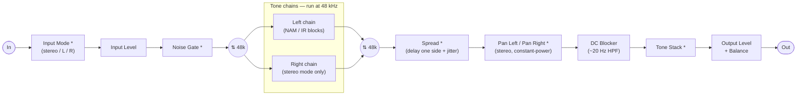
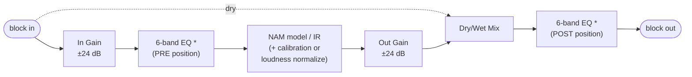

# TONE3000 Plugin

A **JUCE-based VST3/AU plugin** that lets you load **Neural Amp Modeler (NAM)** profiles and **Impulse Responses (IR)** directly from [TONE3000](https://www.tone3000.com) using the [TONE3000 Select flow](https://www.tone3000.com/api#select). No need to download files manually—browse, sign in, and add tones from the TONE3000 catalog straight into your plugin chain.

## What it does

- **Load NAM and IR from TONE3000** — Click the **+** icon to open the TONE3000 Select flow (`prompt=select_tone`, OAuth 2.0 + PKCE) in the plugin's WebView. Sign in with your TONE3000 account, pick a tone, and it's added to your chain with the correct model/IR.
- **Build a signal chain** — Add multiple NAM and IR blocks, reorder them, switch between models per tone, and remove blocks.
- **Cross-platform** — Same plugin on macOS, Windows, and Linux (desktop). UI is a React app served in a native WebView (WebView2 on Windows, WebKit elsewhere).

The plugin uses **NeuralAmpModelerCore** (in-tree) for NAM processing, **AudioDSPTools** (in-tree) for resampling, and the [TONE3000 API](https://www.tone3000.com/api) for browsing and loading tones.

### How the Select flow works in this plugin

1. The user clicks **+**. The plugin's single WebView generates a PKCE challenge and navigates to `https://www.tone3000.com/api/v1/oauth/authorize?prompt=select_tone&...`. The user signs in (if needed) and picks a tone right inside the plugin.
2. TONE3000 redirects the WebView back to `index.html?code=…&state=…&tone_id=…`. React mounts again, exchanges the code for `{access_token, refresh_token}`, and (covered by a "Returning from TONE3000…" overlay while it works) fetches `GET /api/v1/tones/{id}` and `GET /api/v1/models?tone_id=…`.
3. The React app hands the access token to the native side via the `setAccessToken` JUCE function, then asks native to load the tone. The C++ download path attaches `Authorization: Bearer …` when fetching `model_url`.

---

## Prerequisites

- **Build** [CMake](https://cmake.org/download/) 3.22+, [Git](https://git-scm.com/).
- **JUCE** — Fetched automatically via CMake (no manual install).
- **Node.js & npm** — For building the React UI (see [Build the UI](#1-build-the-ui-first)).
- **Windows only:** [WebView2](https://developer.microsoft.com/en-us/microsoft-edge/webview2/) (e.g. via `script/install-webview2.ps1`).

---

## Quick start

### 1. Build the UI first

The plugin embeds a built React UI. From the repo root:

```sh
cd ui
npm install
npm run build
cd ..
```

Do this on all platforms (Linux, macOS, Windows) before building the C++ plugin.

#### TONE3000 publishable key + redirect URIs

Before the first build (or before running the dev server), set your TONE3000 publishable key — the bundled webview reads it at build time:

```sh
# ui/.env (or pass on the command line for a single build)
VITE_T3K_PUBLISHABLE_KEY=t3k_pub_your_key_here
# Optional — point at staging or self-hosted TONE3000:
# VITE_T3K_API_DOMAIN=https://staging.tone3000.com
```

Then in TONE3000 → Settings → API Keys, add the redirect URIs the WebView will use to your key. Because the Select flow now runs in the same single WebView that serves the main UI, the redirect URI is just the page React already loads from:

| Build         | Redirect URI                       |
| ------------- | ---------------------------------- |
| Vite dev      | `http://localhost:5173/`           |
| macOS / Linux | `juce://juce.backend/index.html`   |
| Windows       | `https://juce.backend/index.html`  |

Localhost origins are auto-allowed during development, so only the JUCE entries need to be registered for release builds.

### 2. Get submodules

```sh
git submodule update --init --recursive
```

### 3. Configure and build

The default build includes the GUI (Standalone, VST3, AU, AAX, LV2, CLAP). For headless/embedded builds, add `-DHEADLESS=ON`. Individual formats can be switched off with `-DBUILD_AAX=OFF`, `-DBUILD_LV2=OFF`, `-DBUILD_CLAP=OFF`. CLAP support comes from [clap-juce-extensions](https://github.com/free-audio/clap-juce-extensions), fetched automatically at configure time.

```sh
# Debug
cmake -B build -S . -DCMAKE_BUILD_TYPE=Debug

# Release
cmake -B build -S . -DCMAKE_BUILD_TYPE=Release
```

**Linux:** use the project’s Linux toolchain, for example:

```sh
cmake -B build -S . -DCMAKE_BUILD_TYPE=Release \
  -DCMAKE_TOOLCHAIN_FILE=cmake/linux-toolchain.cmake
```

Then:

```sh
cmake --build build
```

**Note:** Pick a CMake preset before the first build; if you switch presets later, you may need to remove the `build` directory and reconfigure.

### 4. Run the plugin

**Standalone (double-click / open app)**

```sh
# Debug
cd build/plugin/TONE3000_artefacts/Debug/Standalone

# Release
cd build/plugin/TONE3000_artefacts/Release/Standalone
```

- **macOS:** `open ./TONE3000.app`
- **Linux:** `chmod +x TONE3000 && ./TONE3000`
- **Windows (PowerShell):** `./TONE3000.exe`

**Run Debug with logs in terminal**

To see `DBG()` and other log output, run the standalone **binary** directly so stdout/stderr go to your terminal:

- **macOS:**
  ```sh
  ./build/plugin/TONE3000_artefacts/Debug/Standalone/TONE3000.app/Contents/MacOS/TONE3000
  ```
- **Linux:** from repo root,
  ```sh
  ./build/plugin/TONE3000_artefacts/Debug/Standalone/TONE3000
  ```
- **Windows (PowerShell):** from repo root,
  ```powershell
  .\build\plugin\TONE3000_artefacts\Debug\Standalone\TONE3000.exe
  ```

**In a DAW**

Copy the built plugin into your system plugin folder (or use [script/](#installing-plugins-with-script)):

| OS | Plugin | Copy to |
|----|--------|--------|
| **macOS** | VST3 | `~/Library/Audio/Plug-Ins/VST3/` |
| **macOS** | AU | `~/Library/Audio/Plug-Ins/Components/` |
| **macOS** | CLAP | `~/Library/Audio/Plug-Ins/CLAP/` |
| **Windows** | VST3 | `C:\Program Files\Common Files\VST3\` |
| **Windows** | CLAP | `C:\Program Files\Common Files\CLAP\` |
| **Linux** | VST3 | `~/.vst3/` |
| **Linux** | LV2 | `~/.lv2/` |
| **Linux** | CLAP | `~/.clap/` |

Built artefacts: **Debug** → `build/plugin/TONE3000_artefacts/Debug/VST3/TONE3000.vst3` (plus `AU/TONE3000.component` on macOS, and `LV2/TONE3000.lv2` / `CLAP/TONE3000.clap` alongside). **Release** → same path with `Release` instead of `Debug`. Then rescan plugins in your DAW.

---

## Linux runtime dependencies

Unlike Windows (WebView2 statically linked) and macOS (WKWebView built into the OS), the Linux build renders its UI in the **system WebKitGTK**, which JUCE loads dynamically at runtime. If it's missing, the plugin window shows a **black screen**.

Required runtime libraries: WebKitGTK **4.1** (or 4.0), GTK3, ALSA, FreeType.

```sh
# Ubuntu / Debian
sudo apt install libwebkit2gtk-4.1-0

# Fedora
sudo dnf install webkit2gtk4.1

# Arch
sudo pacman -S webkit2gtk-4.1

# openSUSE
sudo zypper install libwebkit2gtk-4_1-0
```

The release tarball's `install.sh` checks for these automatically and offers to install anything missing (`./install.sh --check` to verify without installing).

---

## Installing plugins with script

From the repo root, run **`./script/cp-VST3.sh`** or **`./script/cp-AU.sh`** (macOS only) to copy the built plugin into your system plugin folder. Add `Debug` to install the Debug build: `./script/cp-VST3.sh Debug`. Then rescan plugins in your DAW. Other scripts: `create-dmg.sh` (macOS disk image), `install-webview2.ps1` (Windows WebView2, run once).

**macOS CI builds:** If you download a build from GitHub Actions and get “damaged and can’t be opened,” macOS has quarantined it. Run **`./script/fix-quarantine-macos.sh <path-to-extracted-folder>`** (e.g. `./script/fix-quarantine-macos.sh ~/Downloads/TONE3000-macOS\ ARM64-Release`) after extracting. This applies to Standalone, VST3, and AU.

---

## Audio processing setup

The plugin is a JUCE processor with a chain of NAM and IR blocks. Audio runs through the chain (with resampling for NAM when the host sample rate differs from the model), then DC blocker and tone EQ. **NeuralAmpModelerCore** (in `plugin/NeuralAmpModelerCore/`) provides the NAM engine; **AudioDSPTools** (in `plugin/AudioDSPTools/`) provides resampling so NAM runs at its native rate.

### Signal flow

The full path, in processing order (`TONE3000Processor::processBlock` in `plugin/src/Processor.cpp`). Stages marked `*` are bypassable / conditional:



- **Input mode** — when a real stereo source feeds the plugin (stereo host bus, or a stereo standalone input device), a faceplate button picks what enters the chain: both channels (default), or just the left/right one mirrored onto both. Saved with the session, not with presets — it's I/O routing, not tone.
- **Mono mode** — only the Left chain runs (a stereo bus passes both channels through it together) and the pan stage is skipped. If Spread is on, the chain output is doubled to stereo first, then one side is delayed.
- **Stereo mode** — channel 0 feeds the Left chain and channel 1 the Right chain independently; the two pan knobs then place each chain in the stereo image with constant-power law.
- **Tone stack** — one global Bass/Middle/Treble EQ after the DC blocker.
- **48 kHz boundary** — the chains always run at 48 kHz; a Lanczos resampler wraps them when the host rate differs (bypassed at 48 kHz).

Inside every tone block:



Each block's 6-band EQ runs in exactly one position: after the dry/wet mix (**POST**, the default) or between In Gain and the model (**PRE**, the EQ menu's PRE toggle) — never both. A flat or bypassed EQ costs nothing on the audio thread.

Meters tap the signal after input gain (input meters, pre-gate), after each block's In Gain (plus its EQ in the PRE position) and after its final stage (block LEDs), and after output gain (output meters).

---

## Windows: WebView2

On Windows, the UI uses WebView2. Install it once (e.g. from the repo):

```powershell
./script/install-webview2.ps1
```

---

## Licensing and JUCE

This project is licensed under the **MIT License** (see [LICENSE](LICENSE)).

It uses the **JUCE** framework, which has its own licensing (including optional commercial terms). See [JUCE Licensing](https://juce.com/juce-6-licence) for details. **AudioDSPTools**’ ResamplingContainer is from the iPlug2 project (see its license in that source). **NeuralAmpModelerCore** has its own license terms in that directory. The CLAP build uses **clap-juce-extensions** and the **CLAP** SDK (both MIT), fetched at configure time.

---

## Links

- [TONE3000](https://www.tone3000.com) — NAM captures and IRs.
- [TONE3000 API](https://www.tone3000.com/api) — full API reference, including the Select flow (`prompt=select_tone`).
- [TONE3000 API examples](https://github.com/tone-3000/api) — reference integrations + the `tone3000-client.ts` this plugin's client is adapted from.
- [Neural Amp Modeler](https://github.com/sdatkinson/neural-amp-modeler) — Original NAM project (plugin uses in-tree **NeuralAmpModelerCore**).
