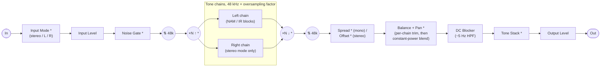

# TONE3000 Plugin

A JUCE-based audio plugin (VST3, AU, CLAP, LV2, Standalone) that loads
**Neural Amp Modeler (NAM)** captures and **impulse responses (IRs)** straight
from [TONE3000](https://www.tone3000.com). No manual file downloads: browse
the catalog, sign in, and add tones directly into your signal chain.

- **Load NAM and IR from TONE3000.** Click **+** to browse the catalog in the
  plugin (OAuth 2.0 + PKCE via the
  [TONE3000 Select flow](https://www.tone3000.com/api#select)). Pick a tone
  and it lands in the chain with the right model or IR.
- **Build a signal chain.** Multiple NAM and IR blocks, per-block EQ and
  gain/mix, drag to reorder, dual chains in stereo mode with branching,
  undo/redo, and presets.
- **Cross-platform.** One plugin on macOS, Windows, and Linux. The UI is a
  React app rendered in a native WebView (WebView2 on Windows, WebKit
  elsewhere).

NAM processing comes from **NeuralAmpModelerCore** (in-tree), resampling from
**AudioDSPTools** (in-tree), and tone browsing/loading from the
[TONE3000 API](https://www.tone3000.com/api).

## Prerequisites

- [CMake](https://cmake.org/download/) 3.22+ and Git
- Node.js and npm (the React UI is built before the plugin)
- **JUCE** is fetched automatically by CMake; no manual install
- **Windows only:** [WebView2](https://developer.microsoft.com/en-us/microsoft-edge/webview2/)
  runtime (`script/install-webview2.ps1` installs it)

## Quick start

### 1. Build the UI

The plugin embeds the built React UI as binary data, so build it first on
every platform:

```sh
cd ui
npm install
npm run build
cd ..
```

#### TONE3000 publishable key and redirect URIs

The webview reads your TONE3000 publishable key at build time. Set it before
the first build (or before running the dev server):

```sh
# ui/.env (or pass on the command line for a single build)
VITE_T3K_PUBLISHABLE_KEY=t3k_pub_your_key_here
# Optional: point at staging or self-hosted TONE3000
# VITE_T3K_API_DOMAIN=https://staging.tone3000.com
```

Then, in TONE3000 > Settings > API Keys, register the redirect URIs the
WebView uses. The OAuth flows run in the same single WebView that serves the
main UI, so the redirect URI is just the page React already loads from:

| Build         | Redirect URI                      |
| ------------- | --------------------------------- |
| Vite dev      | `http://localhost:5173/`          |
| macOS / Linux | `juce://juce.backend/index.html`  |
| Windows       | `https://juce.backend/index.html` |

Localhost origins are auto-allowed during development, so only the JUCE
entries need to be registered for release builds.

### 2. Get submodules

```sh
git submodule update --init --recursive
```

### 3. Configure and build

The default build includes the GUI targets (Standalone, VST3, AU, AAX, LV2,
CLAP). Add `-DHEADLESS=ON` for headless/embedded builds; switch individual
formats off with `-DBUILD_AAX=OFF`, `-DBUILD_LV2=OFF`, `-DBUILD_CLAP=OFF`.
CLAP support comes from
[clap-juce-extensions](https://github.com/free-audio/clap-juce-extensions),
fetched at configure time.

```sh
cmake -B build -S . -DCMAKE_BUILD_TYPE=Release   # or Debug
cmake --build build
```

**Linux:** use the project's toolchain file:

```sh
cmake -B build -S . -DCMAKE_BUILD_TYPE=Release \
  -DCMAKE_TOOLCHAIN_FILE=cmake/linux-toolchain.cmake
```

If you switch CMake presets later, remove the `build` directory and
reconfigure.

### 4. Run it

**Standalone:**

```sh
cd build/plugin/TONE3000_artefacts/Release/Standalone   # or Debug
```

- macOS: `open ./TONE3000.app`
- Linux: `./TONE3000`
- Windows (PowerShell): `./TONE3000.exe`

To see `DBG()` output in Debug builds, run the binary directly so
stdout/stderr reach your terminal (on macOS that is
`TONE3000.app/Contents/MacOS/TONE3000`).

**In a DAW:** copy the built plugin to your user plugin folder and rescan.
`./script/install-plugin.sh VST3` (or `AU`) does the copy on macOS and Linux;
pass `Debug` as the second argument for the Debug build. Artefacts land in
`build/plugin/TONE3000_artefacts/<config>/<format>/`.

| OS      | Format | Install to                              |
| ------- | ------ | --------------------------------------- |
| macOS   | VST3   | `~/Library/Audio/Plug-Ins/VST3/`        |
| macOS   | AU     | `~/Library/Audio/Plug-Ins/Components/`  |
| macOS   | CLAP   | `~/Library/Audio/Plug-Ins/CLAP/`        |
| Windows | VST3   | `C:\Program Files\Common Files\VST3\`   |
| Windows | CLAP   | `C:\Program Files\Common Files\CLAP\`   |
| Linux   | VST3   | `~/.vst3/`                              |
| Linux   | LV2    | `~/.lv2/`                               |
| Linux   | CLAP   | `~/.clap/`                              |

## Linux runtime dependencies

Windows links WebView2 statically and macOS uses the OS WKWebView, but the
Linux build renders its UI in the system WebKitGTK, loaded dynamically at
runtime. If it's missing, the plugin window is a black screen.

Required: WebKitGTK 4.1 (or 4.0), GTK3, ALSA, FreeType.

```sh
sudo apt install libwebkit2gtk-4.1-0      # Ubuntu / Debian
sudo dnf install webkit2gtk4.1            # Fedora
sudo pacman -S webkit2gtk-4.1             # Arch
sudo zypper install libwebkit2gtk-4_1-0   # openSUSE
```

The release tarball's `install.sh` checks for these automatically
(`./install.sh --check` to verify without installing).

## Audio processing

The plugin is a JUCE processor running a chain of NAM and IR blocks, anchored
at 48 kHz (a Lanczos resampler wraps the chain when the host rate differs,
bypassed at 48 kHz).

### Signal flow

The full path in processing order (`TONE3000Processor::processBlock` in
`plugin/src/Processor.cpp`). Stages marked `*` are bypassable or conditional:



- **Input mode**: when a real stereo source feeds the plugin, a faceplate
  button picks what enters the chain: both channels (default) or one channel
  mirrored onto both. Saved with the session, not with presets; it's I/O
  routing, not tone.
- **Mono mode**: only the Left chain runs and the pan stage is skipped. With
  Spread on, the chain output becomes an ADT-style stereo double; see
  [`plugin/docs/spread.md`](plugin/docs/spread.md) for the design.
- **Stereo mode**: channel 0 feeds the Left chain and channel 1 the Right
  chain independently. The Balance trim scales each chain (12 dB opposing)
  before the pan knobs place them with a constant-power law, so a balance
  dialed in to match the chains stays correct at any pan position. The
  Offset knob applies a corrective alignment delay (up to 24 ms) to one
  chain, useful when NAM models or IRs carry different baked-in latency; the
  auto-offset button measures it from a couple seconds of playing
  (`plugin/include/AutoOffset.h`).
- **Tone stack**: one global Bass/Middle/Treble EQ after the DC blocker.
- **Oversampling**: an Advanced setting runs the whole chain at 2x/4x/8x the
  48 kHz base rate: minimum-phase half-band filters (zero added latency),
  with NAM models phase-interleaved across N native-rate instances so
  harmonics land in the widened band instead of folding back as aliasing.
  IR blocks are the exception: convolution is linear, so each IR convolves
  at the 48 kHz base rate inside a per-block decimate/interpolate island,
  and IR CPU and sound are identical at every factor. Design notes in
  [`plugin/docs/oversampling.md`](plugin/docs/oversampling.md).
- **Multi-core stereo**: an Advanced setting (on by default, machine-wide)
  processes the two stereo chains concurrently. The Right chain (or, when
  branched, the branch lane) runs on a realtime worker thread while the
  audio thread processes the other, and the audio thread can always steal
  the job back and run serially, so the toggle is pure scheduling and the
  output is bit-identical either way (pinned by
  `test/src/multicore_tests.cpp`). Design notes in
  [`plugin/docs/multicore.md`](plugin/docs/multicore.md).

Inside every tone block:


Each block's 6-band EQ runs in exactly one position: after the dry/wet mix
(POST, the default) or between In Gain and the model (PRE), never both. A
flat or bypassed EQ costs nothing on the audio thread.

Meters tap the signal after input gain (input meters, pre-gate), after each
block's In Gain plus its PRE-position EQ and after its final stage (block
LEDs), and after output gain (output meters).

### DSP tests

A GoogleTest suite pins the chain's DSP invariants against the real model and
IR assets in `test/files`:

- `dsp_tests.cpp`: unit-level behavior (oversampler null/transparency/
  aliasing, NAM phase-interleaving exactness, IR island equivalence).
- `processor_tests.cpp`: drives the full `TONE3000Processor` the way a host
  would (48 kHz transparency with zero latency, reported PDC matching the
  measured delay at 44.1/96 kHz, latency stability across oversampling
  toggles, state round trips).
- `multicore_tests.cpp`: parallel stereo output is bit-identical to serial,
  across topologies, host rates, and oversampling factors.
- `spread_tests.cpp`, `swap_fade_tests.cpp`, `branch_tests.cpp`, and friends
  cover the doubler, engine-swap fades, and chain routing.

```sh
./script/test-dsp.sh                        # build + run everything
./script/test-dsp.sh 'IrConvolutionTest.*'  # gtest filter
```

`test/src/os_bench.cpp` is a standalone CPU benchmark for the oversampled NAM
path (build instructions in its header).

## Repository layout

| Path            | Contents                                              |
| --------------- | ----------------------------------------------------- |
| `plugin/`       | C++ plugin: processor, DSP, editor, webview bridge; vendors NeuralAmpModelerCore and AudioDSPTools |
| `plugin/docs/`  | Design docs (spread, oversampling, multi-core)        |
| `ui/`           | React/TypeScript UI (see [ui/README.md](ui/README.md))|
| `test/`         | GoogleTest DSP suite + test assets                    |
| `script/`       | Build, packaging, and install helpers                 |
| `libs/`         | CPM-fetched dependencies (JUCE, GoogleTest, ...)      |
| `design/`       | Figma exports and UI reference assets                 |

## Licensing

This project is licensed under the **MIT License** (see [LICENSE](LICENSE)).

JUCE has its own licensing, including optional commercial terms; see
[JUCE Licensing](https://juce.com/juce-6-licence). **NeuralAmpModelerCore**
carries its own license terms in its directory. **AudioDSPTools**'
`ResamplingContainer` originates from the iPlug2 project (license in that
source). The CLAP build uses **clap-juce-extensions** and the **CLAP** SDK
(both MIT), fetched at configure time.

## Credits

- [Neural Amp Modeler](https://github.com/sdatkinson/neural-amp-modeler) by
  Steven Atkinson: the NAM ecosystem and
  [NeuralAmpModelerCore](https://github.com/sdatkinson/NeuralAmpModelerCore),
  which powers all amp modeling here.
- [AudioDSPTools](https://github.com/sdatkinson/AudioDSPTools): resampling
  around the 48 kHz chain boundary, with `ResamplingContainer` from
  [iPlug2](https://github.com/iPlug2/iPlug2).
- [NAM-Oversampler](https://github.com/DLC86/NAM-Oversampler) by DLC86:
  pioneered oversampled NAM processing; the chain oversampler's half-band
  allpass coefficients are adapted from its AudioDSPTools fork (MIT). See
  [`plugin/docs/oversampling.md`](plugin/docs/oversampling.md).
- [JUCE](https://juce.com): plugin framework, DSP building blocks, and the
  WebView UI bridge.
- [clap-juce-extensions](https://github.com/free-audio/clap-juce-extensions):
  the CLAP wrapper.
- O. Das, ["An Open-Source Stereo Widening Plugin"](https://www.dafx.de/paper-archive/2024/papers/DAFx24_paper_92.pdf)
  (DAFx24): the allpass decorrelation approach used by the spread doubler.
- [dnd-kit](https://dndkit.com), [lucide](https://lucide.dev), and
  [react-knob-headless](https://github.com/satelllte/react-knob-headless) in
  the UI.

## Links

- [TONE3000](https://www.tone3000.com): NAM captures and IRs.
- [TONE3000 API](https://www.tone3000.com/api): full API reference, including
  the Select flow.
- [TONE3000 API examples](https://github.com/tone-3000/api): reference
  integrations, including the `tone3000-client.ts` this plugin's client is
  adapted from.
