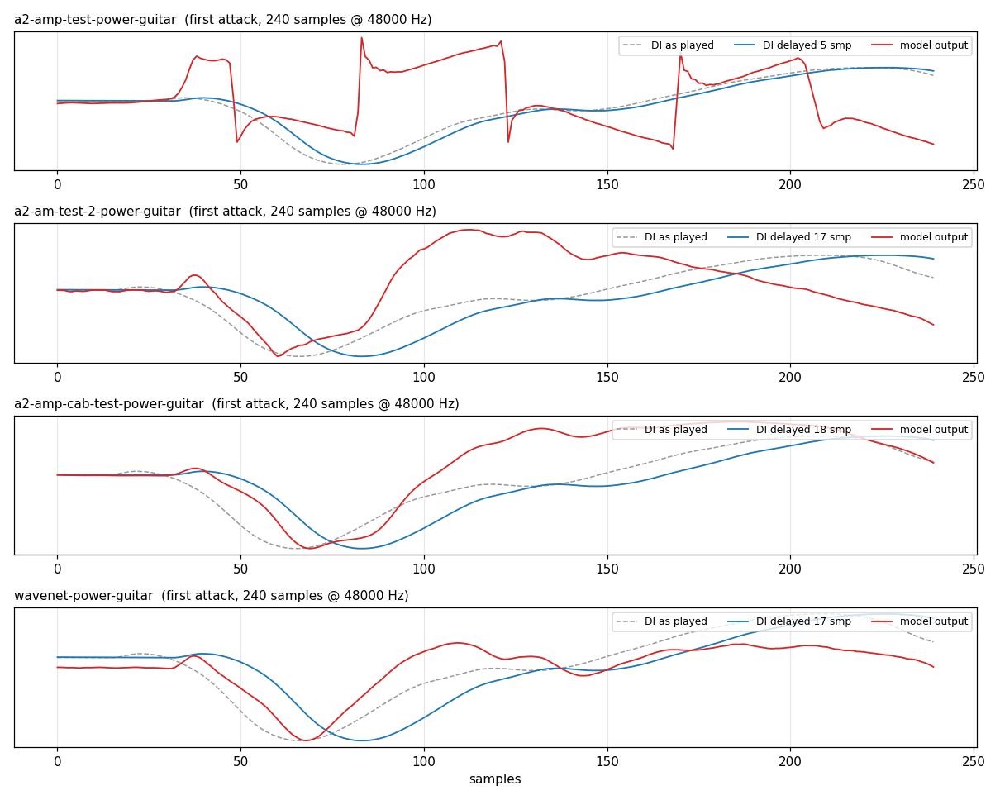
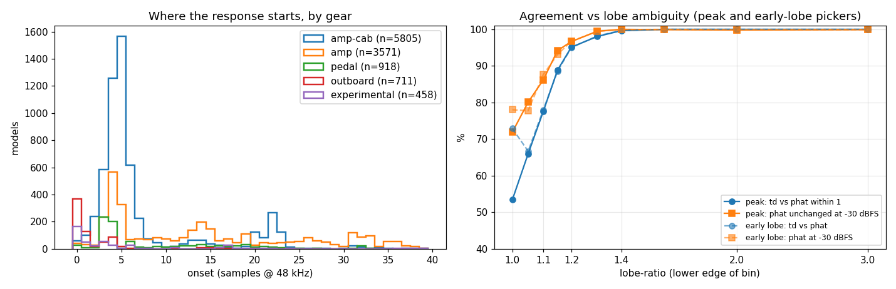

# Model latency: measuring a NAM model's baked-in delay at load time

Record of how the plugin measures the latency and polarity of a NAM model
(or IR) by probing it, reduced to a dependency-free form that other
integrators can drop into their own engine. The plugin has done this since
the stereo Align feature shipped: the auto-align button drives both chains
with an internal sweep and cross-correlates one against the other
(`plugin/include/AutoOffset.h`). The question this document answers,
prompted by a hardware partner asking how to measure and store each
model's latency when it is imported, is whether the same measurement works
*per model* against the dry probe, how cheap it is, and whether a version
without an FFT is good enough. It is, it is very cheap, and a plain
cross-correlation works provided the probe has a white spectrum (which the
plugin's exponential sweep does not; see Results). A run over 11,463
models from the public catalog (see "At catalog scale") then showed where
the blind spots are: not the analyzer, but models whose response has two
near-equal lobes of opposite sign, where *any* peak-picker is a coin flip
(flagged by `lobeRatio` / `ambiguous`), and a 1.8% of very high-gain
models whose output barely correlates with any probe (caught by
`peakRatio`).

Assets live in [`plugin/docs/model-latency/`](model-latency/): the
header-only measurement, a CLI harness on NeuralAmpModelerCore, the raw
results on the test models and the catalog, and renders of a guitar DI
through each test model aligned by the measured latency.

## The problem

NAM models are user-generated. The trainer aligns the dry and recorded
signals before training by detecting the alignment blips in the standard
reamp file, and a model trained on well-aligned data has essentially zero
latency (one sample: the trainer's safety factor). But the alignment can be
bypassed, overridden, or defeated by a reamp chain that already compensated
for its own latency, and the result is a model with the misalignment baked
into its weights as a pure delay: silent for N samples, then the response.
We have measured 0.35 ms (17 samples at 48 kHz) in the wild, and some
models additionally come out polarity-inverted.

A fraction of a millisecond is inaudible on its own. It is very audible
when the model is summed with anything correlated: a dry blend (Mix below
100%), a parallel chain, a hardware unit's own amp block running alongside
a NAM block. Then it is a comb filter.

Nothing in the `.nam` file says how late a model is, so the player has to
measure it. The loudness field is the model for how to store the answer:
measure once, keep it next to the weights, apply it on playback.

## Prior art

- A. Farina, *Simultaneous measurement of impulse response and distortion
  with a swept-sine technique* (108th AES Convention, 2000): the
  exponential sine sweep as a probe for nonlinear systems. The sweep drives
  the system across its band at realistic level while its harmonic
  distortion products land at negative lags in the deconvolved response,
  away from the linear part the latency lives in.
- C. Knapp, G. Carter, *The generalized correlation method for estimation
  of time delay* (IEEE TASSP 1976): GCC-PHAT. Normalizing each
  cross-spectrum bin by its magnitude turns the correlation into a
  phase-only estimate whose peak approaches a delta at the true lag,
  independent of either signal's spectral shape.
- The NAM trainer's blip calibration (`nam/train/core.py`): threshold
  detection on the alignment blips, then `recommended = detected -
  safety_factor` (safety factor 1). Files written by recent trainers
  record the applied shift in `metadata.training.data.latency`, which
  gives an independent check on the measurement for files that carry it.

## Method

1. Load the model and prewarm it (NAM core's `Reset()` does this).
2. Run a short, known probe through it: a 100 ms sine sweep at -20 dBFS
   followed by 10 ms of silence. Capture the output.
3. Cross-correlate the output against the probe over lags 0..10 ms. The lag
   of the peak is the latency; the sign of the peak is the polarity.

The probe is deterministic, so there is no gating, no timeout, no waiting
for the player, and the result is repeatable to a fraction of a sample. The
plugin's auto-align runs this with two chains and correlates chain A
against chain B (relative lag). Per-model at load time is the same code
with the dry probe as the reference, which is the simpler problem (one
unknown) and gives the absolute number. Lags are searched from zero: a
causal model cannot produce negative latency, and misaligned training data
only ever bakes in positive delay.

[`nam_latency.h`](model-latency/nam_latency.h) implements two analyzers
over the same sweep capture, plus a third method that skips the sweep:

**Time domain.** `c[k] = Σ x[n]·y[n+k]`. No FFT, no allocation beyond the
capture, 4800 × 481 ≈ 2.3 M multiply-adds at the defaults. With a *linear*
sweep (white spectrum, autocorrelation ≈ delta) `c[k]` is the model's
small-signal impulse response, which is also a useful thing to log.

**GCC-PHAT.** The plugin's method: FFT both signals, form `Y·conj(X)`,
divide each bin by `|·|^0.8` (soft PHAT: full whitening would amplify empty
bins into noise), inverse FFT, peak-pick. The whitening removes both the
model's voicing and the probe's spectral tilt, so the peak is sharper and
the sub-sample estimate (the whitened cross-spectrum's inverse DFT
evaluated on a fine grid around the integer peak) carries none of parabolic
interpolation's position-dependent bias. Needs a power-of-two complex FFT;
a 30-line radix-2 one is included for portability.

**Click** (`measureImpulse`). The obvious cheaper idea: skip the sweep,
feed one sample and read the response directly. 10 ms of silence to learn
the model's idle output, one sample, 10 ms of capture; the output minus
idle *is* the impulse response and peak/onset/polarity read straight off
it. ~1000 samples of inference instead of 5300, no correlation at all. It
is in the header so the comparison can be run, and the comparison is why
it is not recommended for amp models; see "A click instead of a sweep"
under Results.

All three return the same `Result`:

| field            | meaning |
|------------------|---------|
| `latencySamples` | integer lag of the correlation peak: what to align on |
| `latencyFine`    | sub-sample refinement |
| `onsetSamples`   | first lag with ≥ 30% of the peak: where the response starts |
| `inverted`       | polarity flipped |
| `confidence`     | normalized correlation at the peak, 0..1; diagnostic only (nonlinear models legitimately read 0.3–0.8) |
| `peakRatio`      | peak over the best competitor more than 1 ms away; the plugin's gate (rejects below 2) |
| `lobeRatio`      | peak over the largest lobe 2 samples to 1 ms away: the competitors `peakRatio` ignores |
| `ambiguous`      | `lobeRatio` below `lobeTolerance` (1.1): the peak lag and polarity are a coin flip between two lobes (see "At catalog scale") |
| `earlySamples`, `earlyInverted` | the earliest lobe within `lobeTolerance` of the biggest; equals the peak when unambiguous, a more stable pick when not |
| `correlation`    | the normalized `c[k]`, for logging |

GCC-PHAT takes its peak, lobes and polarity from the whitened correlation
but its onset from the plain one (one extra inverse FFT of the
cross-spectrum it already has): whitening pre-rings, and on the catalog the
whitened onset moved exactly with an injected delay on only 90% of models
versus 98% for the plain correlation. With that change the two analyzers'
onsets are the same number by construction.

Peak and onset coincide for a pure delay. For a model with a cab baked in
the response rises over several samples and the onset is earlier than the
peak. The peak is what sums in phase with a parallel path; the onset says
whether the gap is misaligned training data or just the response's rise
time.

Two defaults were set by the catalog run rather than by taste. The sweep
goes to 20 kHz, not 16: the probe's bandwidth is the correlation's time
resolution, and at 16 kHz the identity's own correlation reads 0.42 at
lag 1 with −20 dB sidelobes, so with a −20 dB onset threshold "onset" was
reporting the probe's sidelobes, not the model (an injected 37-sample delay
moved the onset by exactly 37 on only 31% of models). At 20 kHz the
neighbour is 0.20 and the sidelobes −13 dB; a −10 dB onset threshold clears
both and the onset moves exactly with an injected delay on 98% of models.
Longer edge fades make the sidelobes worse, not better; 5 ms stays.

## Results

[`nam_latency_tool`](model-latency/nam_latency_tool.cpp) runs all three
methods over `.nam` files and `.wav` IRs (convolved directly) and prints
the estimated impulse response. Build with
[`build.sh`](model-latency/build.sh) (compiles the vendored NAM core
straight in, ~20 s), then
`build/nam_latency_tool test/files/*.nam test/files/*.wav`. Full output in
[`results-default.txt`](model-latency/results-default.txt) (that run also
passed `--di "Power - Guitar.wav" --di-seconds 4` for the renders under
Validation; the clip is at the URL given there).

| file | time-domain | gcc-phat | onset td / phat | polarity | peak-ratio td / phat | lobe-ratio td / phat | note |
|------|------------:|---------:|----------------:|----------|---------------------:|---------------------:|------|
| `test/files/a2-amp-test.nam` | 5 | 5 | 1 / 0 | normal | 98 / 35 | 1.08 / 1.06 | trainer metadata: detected 5, applied 4. Response starts at 0; lobes at 2 (−0.88) and 5 (+1.00) are near-equal, so the peak is ambiguous (see Robustness) |
| `test/files/a2-am-test-2.nam` | 17 | 17 | 17 / 17 | normal | 122 / 57 | 1.42 / 1.43 | **0.36 ms of pure delay baked in**: silent until lag 16, sharp impulse at 17 |
| `test/files/a2-amp-cab-test.nam` | 17 | 18 | 14 / 16 | normal | 8 / 16 | 1.19 / 1.89 | cab-like rise from lag 14, peak 17–18 |
| NAM core `wavenet.nam` | 16 | 17 | 16 / 16 | normal | 185 / 121 | 1.48 / 1.63 | trainer metadata: detected −16, applied −17: **matches** (fine lag 16.5) |
| NAM core `A2.nam` | 3 | 3 | 0 / 2 | inverted | 10 / 14 | 1.28 / 1.96 | |
| NAM core `lstm.nam` | 0 | 0 | 0 / 0 | normal | 155 / 559 | 6.4 / 6.2 | |
| `test/files/cab-ir-test.wav` | 2 | 1 | 1 / 1 | normal | 5 / 8 | 1.23 / 1.63 | |
| `test/files/cab-ir-test-2.wav` | 10 | 10 | 7 / 7 | normal | 6 / 7 | 1.26 / 2.30 | |
| `test/files/reverb-ir-mono-test.wav` | 348 | 348 | 345 / 346 | inverted | 4 / 4 | 1.45 / 1.50 | 7.9 ms pre-delay in the IR |

The two sweep analyzers agree within a sample on all nine. The estimated
impulse responses make the baked-in case unmistakable. `a2-am-test-2.nam`,
lags 0..23, normalized to the peak:

```
-0.00 -0.02 +0.02 -0.02 +0.02 -0.00 -0.02 +0.04 -0.04 +0.02 +0.01 +0.00 +0.11 -0.02 +0.16 +0.03 +0.04 +1.00 +0.46 -0.70 -0.33 ...
```

against `a2-amp-test.nam`, which starts responding at lag 0 (and whose
lobes at 2 and 5 are the near-equal pair the lobe-ratio warns about):

```
+0.21 -0.37 -0.92 -0.49 +0.48 +1.00 +0.91 +0.51 +0.15 -0.03 ...
```

Cost, per model, on an M-series laptop (median over 11,463 catalog
models): load 3.3 ms, probe through the model 2.8 ms (5280 samples of A2
inference), analysis 1.0–1.5 ms for either method. The measurement is
dominated by running the model over 110 ms of audio; the analysis is
noise.

### The probe shape matters for the simple method

The plugin's `AutoOffset` uses an exponential sweep. Fed to the time-domain
analyzer it gives wrong answers with peak-ratio 1.2–1.7 (no clear winner):
the exponential sweep has a pink spectrum, so its autocorrelation is broad
and low-frequency heavy and the correlation peak lands on the model's
low-frequency phase, not its onset. GCC-PHAT is unaffected (its whitening
cancels the tilt), which is why the plugin never noticed. The linear sweep
is white, and with it both analyzers agree. `nam_latency.h` defaults to the
linear sweep; the exponential one is kept as an option and documented as
"pair with GCC-PHAT only". (Switching `AutoOffset` itself to a linear sweep
would be harmless and is noted under Follow-ups.)

### A click instead of a sweep

[`results-impulse.txt`](model-latency/results-impulse.txt) runs the click
at −6, −20, −34, −46 and −60 dBFS against the sweep methods on six
models. Where the thing being measured is linear it is exact: the three
`.wav` IRs, `lstm.nam` (0 at every level) and the near-linear
`wavenet.nam` (16–17 at every level) all match the sweep to the sample.
On the A2 amp models it is not usable:

| model (sweep answer) | click −6 dBFS | −20 | −34 | −46 | −60 |
|----------------------|--------------:|----:|----:|----:|----:|
| `a2-amp-test` (5, onset 0) | 215 | 206 | 67 | 4 | 8 |
| `a2-am-test-2` (17) | 68 inv | 17 | 20 inv | 17 | 17 |
| `a2-amp-cab-test` (17–18) | 18 | 23 inv | 23 inv | 23 inv | 23 inv |
| `A2.nam` (3 inv) | 7 | 6 | 6 | 3 inv | 3 inv |

The answer depends on the click level and never settles, and at −34 dBFS
on `a2-am-test-2` it is *confidently* wrong: the response's first arrival
is at 17 (+0.65 normalized) but the undershoot three samples later is
bigger (−1.00), so peak-on-magnitude reports 20 samples, inverted, with a
peak-ratio of 9 that sails through the gate. A single-sample spike is a
signal no guitar ever produced; the net's response to it is an
out-of-distribution transient, asymmetric and, at −6 dBFS, followed by a
slow multi-millisecond excursion that dwarfs the actual arrival. Making it
quieter does not make it linear: a net at idle sits at some arbitrary
point on its activations, and a tiny perturbation reads that point's local
slope, not the model's behaviour over a guitar-sized swing. The sweep's
correlation averages over that swing (it is the best linear fit to the
model across the probe's range), which is the processing gain that
matters here. It is not about noise; a model is deterministic. It is about
the nonlinearity.

The onset reading is steadier (2–4, 17, 15–16, 2 across the levels) but
is a fraction of a peak that is itself unstable, so it inherits the
problem. Nothing in the result distinguishes a good click from a bad one.
Verdict: fine for an IR, where the sweep is overkill anyway; not for a
NAM model. If the inference budget is the concern, a 50 ms sweep gives the
same answers as 100 ms (Robustness, below) for half the cost, and the
measurement is a one-time import cost regardless.

## Validation

- **Injected delay.** `--delay 37` wraps the model in a 37-sample delay
  line: every measurement moves by exactly 37 (5→42, 17→54, 18→55). Over
  the catalog: 99.8% of models for the time-domain peak, 97.9% for
  GCC-PHAT, 98.5% for the onset; the misses are mostly the lobe-ambiguous
  models (below).
- **Polarity.** `--invert` flips the output: `inverted` flips, lags
  unchanged.
- **Trainer metadata.** Where the `.nam` records what the trainer did, it
  matches: `wavenet.nam` detected −16, applied −17, measures 16.5;
  `a2-amp-test.nam` detected 5, applied 4, measures onset 0–1.
- **Real DI.** `--di <file.wav> --di-seconds 4` renders real playing
  through each model and writes `<model>-<di>-aligned.wav`: left = model
  output, right = the DI delayed by the measured latency and
  polarity-corrected. The DIs are the clips the TONE3000 web player ships
  (`ui/public/inputs/` in
  [neural-amp-modeler-wasm](https://github.com/tone-3000/neural-amp-modeler-wasm/tree/main/ui/public/inputs)):
  `Power - Guitar.wav` for the guitar renders ([`results-default.txt`](model-latency/results-default.txt))
  and `Downtown - Bass.wav` for the bass ones ([`results-bass-di.txt`](model-latency/results-bass-di.txt)).
  NAM core's own `example_audio/input.wav` is synthetic and was not used.
  The first picked note of the guitar clip, which opens from digital
  silence, through the four test models:



  On the three 16–18-sample models the DI as played (dashed) starts moving
  ~16 samples before the model output does, and the delayed DI (blue) lands
  on the output's onset. On `a2-amp-test` the output follows the DI almost
  immediately. The DI is at its recorded level, so the high-gain models
  clip visibly; that is what they do to real playing, and the attacks still
  line up. (Each trace is normalized within the plotted window; the first
  note is ~30 dB below the clip's peak.) Renders, guitar:
  [a2-amp-test](model-latency/renders/a2-amp-test-power-guitar-aligned.wav),
  [a2-am-test-2](model-latency/renders/a2-am-test-2-power-guitar-aligned.wav),
  [a2-amp-cab-test](model-latency/renders/a2-amp-cab-test-power-guitar-aligned.wav),
  [wavenet](model-latency/renders/wavenet-power-guitar-aligned.wav);
  bass: [a2-amp-test](model-latency/renders/a2-amp-test-downtown-bass-aligned.wav),
  [a2-am-test-2](model-latency/renders/a2-am-test-2-downtown-bass-aligned.wav),
  [a2-amp-cab-test](model-latency/renders/a2-amp-cab-test-downtown-bass-aligned.wav).
  The bass renders are for listening only: a 240-sample window is a sliver
  of a 41 Hz period and the fingered onsets are soft, so a plot shows
  nothing at this zoom. `--di-gain-db` is available to render the DI
  quieter; it was left at 0 dB here.

  Correlating real guitar *against* the model output is not a measurement,
  and the tool deliberately does not offer it. Guitar is periodic and
  low-frequency heavy, so the peak lands on a pitch period or on the
  low-frequency phase (peak-ratio ≈ 1.0 on every attempt, including
  GCC-PHAT restricted to pick transients, which also fell apart once a
  full-level DI drove `a2-amp-test` into saturation). The controlled
  low-level sweep measures; the DI is for looking and listening.

### Robustness

[`results-selftests.txt`](model-latency/results-selftests.txt):

- `a2-am-test-2` (lobe-ratio 1.4): 17, both analyzers, at every probe
  level from −40 to −10 dBFS and every length from 30 to 280 ms.
- `a2-amp-cab-test` (lobe-ratio 1.19 / 1.89): GCC-PHAT says 18 throughout;
  the time-domain peak jumps to the opposite-sign lobe at 23 at −40 dBFS
  and at 30 ms, and its lobe-ratio reads 1.05–1.06 when it does.
- `a2-amp-test` (lobe-ratio 1.06–1.08, `ambiguous`): both analyzers flip
  between the +1.00 lobe at 5 and the −0.88 lobe at 2 (reported as 2,
  inverted) at 30 and 50 ms. Neither is wrong; the response has no dominant
  arrival. `earlySamples` says 2 / inverted at every length.
- Block size 64 vs 256: identical.

Which is the pattern the catalog confirms at scale: the answer is stable
whenever lobe-ratio is comfortably above 1, and only there. Use ≥ 100 ms
and −20 dBFS, prefer GCC-PHAT when an FFT is available (its whitening
sharpens the lobes), and treat lobe-ratio below ~1.1 as "ambiguous"
rather than picking a side.

## At catalog scale

[`results-catalog.txt`](model-latency/results-catalog.txt) (generated by
[`catalog_stats.py`](model-latency/catalog_stats.py)) is the same tool run
over 11,463 A2 models sampled evenly across the public TONE3000 catalog
(5,805 amp-cab, 3,571 amp, 918 pedal, 711 outboard, 458 experimental) in
five passes: the defaults, −30 dBFS, a 50 ms sweep, an exponential sweep,
and a +37-sample injected delay. Every file loaded. The models were
downloaded for the run and not kept. An earlier 3,233-model run drove the
20 kHz / −10 dB onset defaults, the `lobeRatio` field and the two changes
below; the numbers here are from the final code.



**Ground truth.** The injected delay moved the time-domain peak by exactly
37 on 99.8% of models, GCC-PHAT's on 97.9%, and the onset on 98.5% for
both. Of GCC-PHAT's 238 misses, 173 are lobe-ambiguous models.

**The two analyzers agree within a sample on 90% of models**, exactly on
76%, and on polarity on 92%. The disagreements are not scattered: 712 of
the 1,100 are exactly 5 or 6 samples apart, i.e. the two analyzers picked
adjacent lobes of opposite sign in a cab response. `lobeRatio` separates
them:

| min(lobe-ratio) | share | td ≈ phat | same polarity | phat unchanged at −30 dBFS | at 50 ms |
|---|---:|---:|---:|---:|---:|
| 1.0–1.1 (`ambiguous`) | 16.5% | 59% | 62% | 76% | 86% |
| 1.1–1.25 | 17.4% | 87% | 89% | 92% | 96% |
| 1.25–1.5 | 25.4% | 98% | 99% | 99% | 99% |
| ≥ 1.5 | 40.7% | 100% | 100% | 100% | 100% |

Gating at lobe-ratio ≥ 1.1 keeps 83.5% of models and brings agreement to
97%, polarity to 97%, and stability under probe level / length to 98–99%.
Ambiguity is a property of the model, not the analyzer: when two lobes are
within 1 dB, either lag sums about as well with a parallel path (the
correlation is the same by definition), and the honest output is "either,
polarity uncertain". It is concentrated where it should be: 26% of amp-cab
models, 8% of amp-only, 3% of pedals.

**Early-lobe picking helps, modestly.** Taking the earliest of the tied
lobes instead of the biggest lifts agreement in the ambiguous band from
59% to 70% and polarity agreement from 62% to 73%, and changes the answer
on 5% of models overall. It does not remove the ambiguity (a tie rule has
a boundary too); the flag is still what matters.

**Baked-in delay is common.** Onset is where the response starts, so it is
the number for "how late is this model", independent of lobe choice, and
it is the most stable quantity measured (level-stable on 97%, and still
level-stable on 81% of the models whose peak fails the gate). Over the
catalog: 34% of models start ≥ 8 samples late (0.17 ms), 29% ≥ 12
(0.25 ms), 17% ≥ 20 (0.42 ms). By gear: 62% of amp-only models start ≥ 8
late (median onset 13 samples), 40% of pedals, 20% of amp-cab, 5% of
outboard. The late ones are flat and then rise: on a random 300 of the
late amp-only models the response goes from 15% to 30% of its peak within
2 samples on 90% (3 samples on 97%), so this is delay, not a slow
response. 52% of all models are
polarity-inverted at the peak (65% of amp-cab, 9% of outboard): with a cab
in the model, the sign of the biggest lobe is whatever the mic chain made
it.

**1.8% are unmeasurable by sweep.** 206 models fail `peakRatio ≥ 2` at the
defaults. They are high-gain captures whose output is nearly uncorrelated
with the probe (confidence 0.02–0.08 against a median of 0.50).
[`results-catalog-hardcases.txt`](model-latency/results-catalog-hardcases.txt)
re-probes them hotter (−4 dBFS), quieter (down to −50 dBFS), with a 2 ms
window, and with 280 ms and 1 s sweeps: at best one in six passes (the
1 s sweep, 10× the inference), and quieter makes confidence *worse*,
meaning the output at low level is a learned noise/hum floor rather than a
response. Nothing here is worth a default; treat a gate failure as
"unknown" and apply no correction.

**The click agrees with the sweep on 50% of models** (polarity 61%), and
with itself across a 10 dB level change on 76%. That closes the question
from "A click instead of a sweep".

**The exponential sweep with the time-domain analyzer agrees with the
defaults on 54% of models**; with GCC-PHAT on 93%, the same as any other
perturbation. The pairing warning stands.

## What the measurement found about the trainer

The catalog numbers above say baked-in delay is not an outlier: one model
in three starts at least 0.17 ms late, and among amp-only captures it is
the majority. Two of the local test files show what the mechanism looks
like. NAM core's own
`wavenet.nam` example records `calibration.delays: [-16]`, `recommended:
-17`. A *negative* detected delay is physically impossible (the recorded
blip cannot arrive before the dry one) and means the reamp chain already
compensated for its latency somewhere upstream. The trainer applied the
shift anyway and produced a model that is 16 samples late. `a2-am-test-2`
(trained through a different path, no latency record) shows the identical
signature: 17 samples of clean delay. The upstream fix is small: refuse or
zero a negative detected delay, and warn; and for any training path that
does its own alignment, verify it against the trained model with this
probe. Until then, measuring on the player side is the only defence, and
the player should expect 0.2–0.4 ms to be common.

## Notes for an embedded implementation

- Cost is the model, not the analysis: ~5300 samples of inference per
  model (about 110 ms × the model's real-time CPU fraction; a 50 ms sweep
  halves it). The time-domain analysis is 2.3 M multiply-adds, under a
  millisecond vectorized, and needs no output buffer: each output sample
  `y[m]` adds `x[m−k]·y[m]` into `c[k]` as it arrives. Measure once when a
  model is imported and store the result next to the weights like
  loudness; never at every boot. If it must run at load, it runs on the
  loader thread on the same instance before it goes live (load → `Reset()`
  → probe → `Reset()`), never on the audio thread.
- Don't replace the sweep with a click to save inference; see "A click
  instead of a sweep". Use a shorter sweep.
- Memory: probe 4800 + capture 5280 samples (float buffers are fine; keep
  the accumulators double). Time domain adds 481 lags. GCC-PHAT adds two
  complex 8192-point spectra.
- Probe at the model's native rate (48 kHz for A2), model prewarmed, DC
  removed from the capture (the header does this; some models sit on a
  small offset that would bias the peak toward lag 0).
- Store `earlySamples` / `earlyInverted` (or the peak; same thing when
  unambiguous), `onsetSamples`, `lobeRatio` and `peakRatio`. Gate on
  `peakRatio ≥ 2` (1.8% of the catalog fails: unmeasurable, apply nothing)
  and on `ambiguous == false` (16.5% fails: the two lobes are a coin flip;
  keep the onset, which is stable, and mark peak/polarity uncertain rather
  than apply a correction that may flip next time). On the catalog that
  keeps 83% of models with a 97–99% stable answer and names the rest.
- Keep the sweep to 20 kHz and the onset threshold at −10 dB (the
  header's defaults); the 16 kHz / −20 dB combination reads the probe's own
  sidelobes as onset.
- For an IR the same probe works (latency = pre-delay + onset), or simply
  take the first sample above −40 dB of the peak.

## Implementation in the plugin

`AutoOffset` (`plugin/include/AutoOffset.h`, `plugin/src/AutoOffset.cpp`)
is the production version of the GCC-PHAT path: 280 ms exponential sweep
at -12 dBFS, ±24 ms search window (what the Align Offset knob can express),
rho 0.8, band-limited sub-sample refinement, sharpness gate at 2, a state
machine that fades the output out for the measurement and back in after the
result is applied, and a probe injection / capture tap / mute stage in
`processBlock`. `nam_latency.h` is that algorithm with the chain-vs-chain
reference replaced by the dry probe, the JUCE FFT replaced by a
self-contained one, and the time-domain alternative added.

## Follow-ups

- **Per-block latency compensation.** Measure each block's model at load
  (the loader thread already runs the engine for prewarm) and cache the
  result with the block, like `namEngine->getLoudness()`. Then the Mix
  control's dry path can be delayed to match (a blend below 100% is exactly
  the comb-filter case), and auto-align in stereo mode has a prior from the
  two blocks' numbers before it sweeps.
- **Linear sweep in `AutoOffset`.** Harmless for the PHAT path and makes
  the capture reusable for an impulse-response display or a time-domain
  fallback.
- **Lobe-ratio gate in `AutoOffset`.** Its sharpness gate has the same 1 ms
  guard and so the same blind spot: two cab-bearing chains whose relative
  correlation has near-equal lobes 5 samples apart will be "aligned" to
  whichever won, with a polarity that may flip on the next run. Report
  ambiguity instead.
- **Latency over the API.** Run the same probe server-side during the
  storage migration and return `latency_samples` / `polarity` per model, so
  integrators have the number before the file is even downloaded.
- **Trainer.** Reject negative detected delays (see above), and run this
  probe on the trained model as a regression check: the catalog says a
  third of models ship ≥ 0.17 ms late, most of them amp-only captures.
